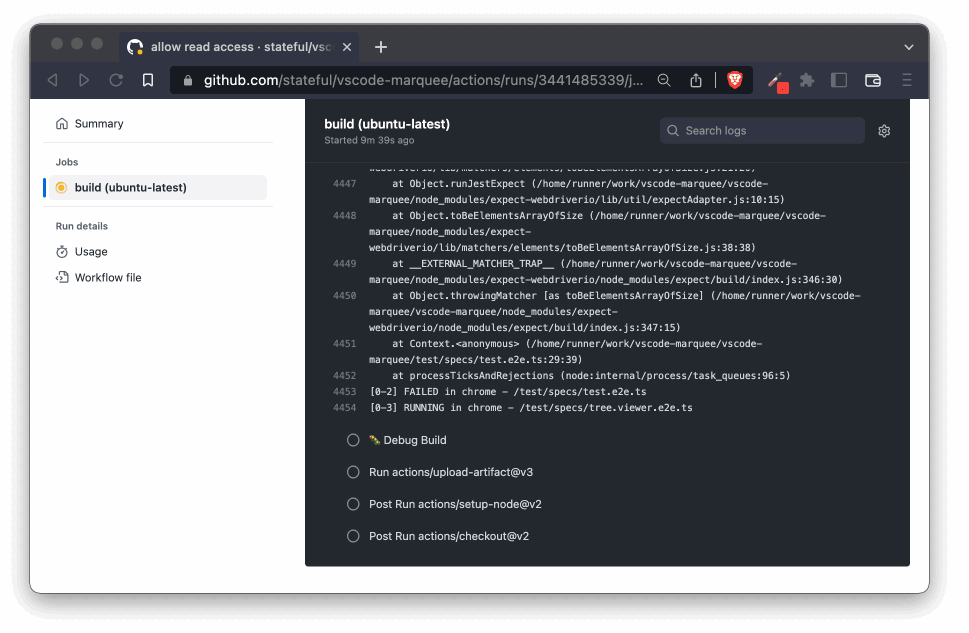

# VS Code Server Action

> A GitHub Action that allows to debug GitHub workflows using VS Code.

Failing CI builds can be annoying especially since we don't have access to the machines that run them. While tests might pass locally for you, they still can fail in the CI environment.

This GitHub Action helps to debug these problems by registering a VS Code Server instance on the CI machine that allows you to connect with the machine in case the build fails.



## Usage

In your GitHub workflow add the following step at the end of all steps:

```yaml
jobs:
  test:
    name: Test
    runs-on: ubuntu-latest
    # make sure these permissions are set so that
    # VS Code can connect to the machine
    permissions:
      actions: read
      contents: read
    steps:
    # ...
    - name: 🐛 Debug Build
      uses: stateful/vscode-server-action@v1
      if: failure()
      with:
        machineName: myMachine # optional, default: GitHub workflow run ID
        timeout: '30000'       # optional, default: 30000
```

In case your build fails the action attempts to start a VS Code Server on the build machine and requests you to authorize it:

```
To grant access to the server, please log into https://github.com/login/device and use code 0328-F81A
```

If you don't authorize the machine until the `timeout` was hit the build just continues. Once authorized through a VS Code Server is started and it prints an URL to connect to, e.g.:

```
Open this link in your browser  https://vscode.dev/tunnel/myMachine/github/workspace
```

You can also connect to it through your local VS Code application. Just open the URL, open the command palette and enter `Open in VS Code`.

## Inputs

- `machineName` (optional): name of the machine to access (default: GitHub Action run id)
- `timeout` (optional): the time until the action continues the build if the machine does not get authorized (default: 30s)

## Contribute

Simply raise a pull request 🙂 Make sure CI passes and then you should be good to go.

